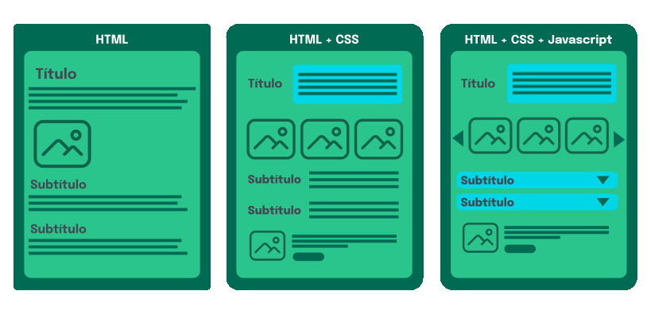

# The Client-Server model and the structure of a web application.

**The Client-Server model is used to describe the way a client (a computer connected to the Web) and a server communicate on the network. You can visualize this idea in the simplified diagram below:**

     +------------+             +------------+
     |            |   request   |            |
     |  Client    |   <----->   |   Server   |
     |            |   response  |            |
     +------------+             +------------+
The structure of your webpage is defined by a text markup language called HTML, which stands for Hyper Text Markup Language. When a user types in a URL and hits Enter, the server processes the request and sends the HTML file back to the client. HTML files contain the content of a website and also links to any assets or additional code needed to properly display the site.

The appearance of the page is defined by a styling language called CSS, which stands for Cascading Style Sheets. CSS is a language that allows you to describe how the elements defined by HTML should be styled. CSS allows you to change the font, color, size, and even include features like animations and audio.

Interactions with the user are defined by a third language: JavaScript. It is JavaScript that gives the page dynamic behavior.

The animation below shows the behavior of HTML, HTML with CSS, and also the behavior when adding JavaScript:

