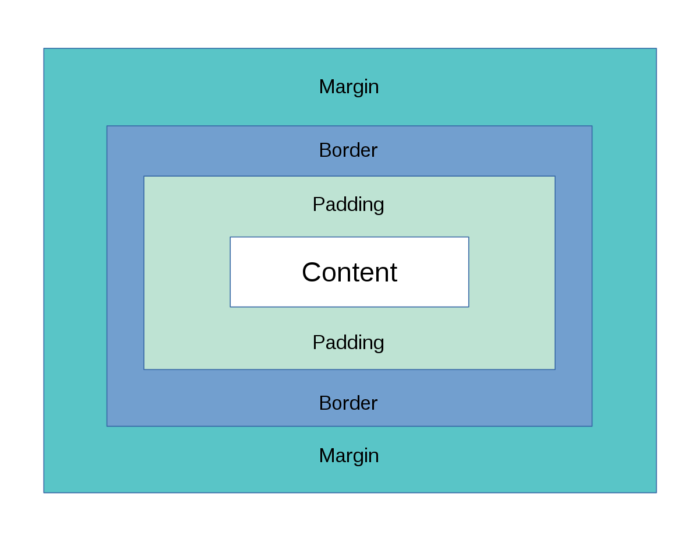

# Selectors

| Selector| Description  |Usage |
| ------ | ----------- | -------- |
| Element Selector | Selects elements based on their tag name  | `p { color: red; }` selects all `
` elements and changes their color to red |
| Class Selector  | Selects elements with a specific class name | `.my-class { font-weight: bold; }` selects all elements with class `my-class` and makes their text bold|
| ID Selector | Selects an element with a specific ID | `#my-id { background-color: yellow; }` selects the element with ID `my-id` and changes its background color to yellow |
| Descendant Selector  | Selects elements that are descendants of another element  | `ul li { color: blue; }` selects all `<li>` elements that are descendants of a `<ul>` element and changes their color to blue                               |
| Child Selector  | Selects elements that are direct children of another element | `ul > li { font-style: italic; }` selects all `<li>` elements that are direct children of a `<ul>` element and makes their text italic  |
| Adjacent Sibling Selector | Selects the sibling element immediately following another element | `h1 + p { text-transform: uppercase; }` selects the first `
` element that comes immediately after an `<h1>` element and transforms its text to uppercase |
| General Sibling Selector  | Selects all sibling elements that follow another element | `h2 ~ p { font-size: 16px; }` selects all `
` elements that follow an `<h2>` element and sets their font size to 16px |
| Universal Selector | Selects all elements  | `* { margin: 0; padding: 0; }` sets the margin and padding of all elements to 0 |

 
 

# CSS Box Model: The box model for HTML elements
The CSS Box Model is a concept that describes how HTML elements are displayed on a page, like a rectangular box that has content, padding, borders, and margins.

The content is the inner part of the box, where text and images are displayed. The padding is the area between the content and the border, where a background color or image can be defined. The border is the line that surrounds the box, which can have a defined color, width, and style. The margin is the area outside the box, which defines the white space between one element and other elements on the page.

When applying styles to an HTML element, it's important to consider how the Box Model works to avoid layout and positioning issues on the page. For example, the width of an element includes the content, padding, and border, but not the margin.

